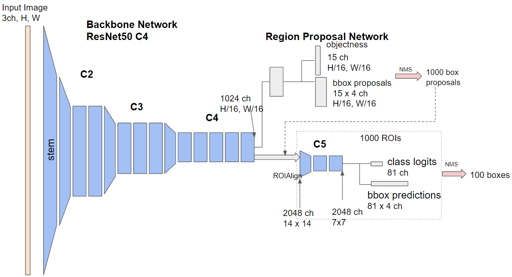

# Inference Pipeline

- [Image Preprocessing](#image-preprocessing)
- [Backbone Network](#backbone-network)
- [Region Proposal Network](#region-proposal-network)
- [Box Head](#box-head)
- [Visualization](#visualization)

Schematic of Faster R-CNN R-50-C4 model.

<p align="left"></p>

## Image Preprocessing

The input image is read using opencv.

    image = cv2.imread(args.image)
    
The image is transformed and registered as an ImageList object.

    image = self.transforms(original_image)
    image_list = to_image_list(image)
    image_list = image_list.to(self.device)

Transformation consists of np-to-PIL conversion, resizing, PIL-to-Tensor conversion, and value range normalization.

    transform = T.Compose(
        [
            T.ToPILImage(),  # convert np.ndarray to PIL Image
            T.Resize(self.min_image_size), # resize the image
            T.ToTensor(),  # convert PIL Image to Tensor with value range of 0 to 1
            to_bgr_transform,  # change the value range to [0, 255]
            normalize_transform  # normalize the value range
        ]
    )

The ImageList class has two instance variables - tensors and image_sizes.

    class ImageList(object):
        def __init__(self, tensors, image_sizes):
            self.tensors = tensors
            self.image_sizes = image_sizes

### Run inference

[GeneralizedRCNN](faster_rcnn_minimum/modeling/detector/generalized_rcnn.py) is a generic RCNN class. In our case, the class is specified to represent Faster R-CNN C4.

    def __init__(self, cfg):
        super(GeneralizedRCNN, self).__init__()
        self.backbone = build_backbone(cfg)
        self.rpn = build_rpn(cfg, self.backbone.out_channels)
        self.roi_heads = build_roi_heads(cfg, self.backbone.out_channels)


## Backbone
The backbone network extracts a feature map from an input image.

The input tensor in the ImageList object is fed to the backbone network.

    features = self.backbone(images.tensors)

#### ResNet50StagesTo4

ResNet50-C4 has the following network parameters.

    ResNet50StagesTo4 = tuple(
        StageSpec(index=i, block_count=c, return_features=r)
        for (i, c, r) in ((1, 3, False), (2, 4, False), (3, 6, True))
    )
    
StageSpec defines number of bottleneck modules in each resnet stage.

The following blocks are used for feature extraction:
- 'stem' block : conv (7x7, stride=2), BN, ReLu, max pooling (3x3, stride=2)
- stage 1 (C2, 1/4 scale) : 3 bottleneck blocks
- stage 2 (C3, 1/8 scale) : 4 bottleneck blocks (1st conv's stride is 2)
- stage 3 (C4, 1/16 scale): 6 bottleneck blocks (1st conv's stride is 2)


    outputs = []
    x = self.stem(x)
    for stage_name in self.stages:
        x = getattr(self, stage_name)(x)
        if self.return_features[stage_name]:
            outputs.append(x)  # only the output from C4
    return outputs
        
[stem block](faster_rcnn_minimum/modeling/backbone/resnet.py#L272-L291):

    x = self.conv1(x)
    x = self.bn1(x)
    x = F.relu_(x)
    x = F.max_pool2d(x, kernel_size=3, stride=2, padding=1)
    return x

[bottleneck](faster_rcnn_minimum/modeling/backbone/resnet.py#L185-L269):

    identity = x

    out = self.conv1(x)
    out = self.bn1(out)
    out = F.relu_(out)

    out = self.conv2(out)
    out = self.bn2(out)
    out = F.relu_(out)

    out0 = self.conv3(out)
    out = self.bn3(out0)

    if self.downsample is not None:
        identity = self.downsample(x)

    out += identity
    out = F.relu_(out)

    return out

At this point, the feature map's shape is [B, 1024, H / 16, W / 16] where B is a batchsize.

## Region Proposal Network
[Region proposal network](faster_rcnn_minimum/modeling/rpn/rpn.py#L47-L93) obtains object proposal boxes.  
    
    proposals = self.rpn(images, features, targets)
    
where self.rpn() is the forward function of RPNModule:

    # RPNModule
        objectness, rpn_box_regression = self.head(features)
        anchors = self.anchor_generator(images, features) # Generate 15 anchors
        boxes = self.box_selector_test(anchors, objectness, rpn_box_regression)

### RPN Head

[RPN head](faster_rcnn_minimum/modeling/rpn/rpn.py#L15-L43) consists of three conv layers.     
```
cls_logits (objectness) : [B, A, H / 16, W / 16]  
bbox_pred : [B, A * 4, H / 16, W / 16]  
```
where A is the number of anchors.

    t = F.relu(self.conv(feature)) # 3x3 conv, 1024 ch to 1024 ch, stride = 1
    logits.append(self.cls_logits(t)) # 1x1 conv, 1024 ch to 15 ch, stride = 1
    bbox_reg.append(self.bbox_pred(t)) # 1x1 conv, 1024 ch to 60 ch, stride = 1

### RPNPostProcessor
At [RPNPostProcessor](faster_rcnn_minimum/modeling/rpn/inference.py#L15-L107), 
the proposed boxes (top 6000 boxes sorted by objectness score) are processed.
Non-maximum Suppression (NMS) filters the overlapping boxes and 1000 boxes survive.

    boxlist = BoxList(proposal, im_shape, mode="xyxy")
    boxlist.add_field("objectness", score)
    boxlist = boxlist.clip_to_image(remove_empty=False)
    boxlist = remove_small_boxes(boxlist, self.min_size)
    boxlist = boxlist_nms(
        boxlist,
        self.nms_thresh,
        max_proposals=self.post_nms_top_n,
        score_field="objectness",
    )
    result.append(boxlist)
            
## Box Head
[ROI heads](faster_rcnn_minimum/modeling/roi_heads/roi_heads.py#L9-L17) crop each object's ROI and its fine location and class (labels) are inferred.

   

    x, result = self.roi_heads(features, proposals)

[ROIBoxHead](faster_rcnn_minimum/modeling/roi_heads/box_head/box_head.py)
consists of a pooler, a feature extractor, a box / class predictor, and a post processor.

    x = self.pooler(x, proposals) # ROIAlign
    x = self.head(x) # feature extractor
    class_logits, box_regression = self.predictor(x) # box / cls prediction
    result = self.post_processor((class_logits, box_regression), proposals) # postprocess


### ROIAlign

ROIAlign is a cropping method proposed in the Mask R-CNN paper.
The method is implemented using C++ or cuda.

input:  [B, 1024, H / 16, W / 16]  
boxes:  [1000, 5]  
output: [1000, 1024, 14, 14]  

    self.poolers.append(
        ROIAlign(output_size, spatial_scale=scale, sampling_ratio=sampling_ratio)
    )

    rois = self.convert_to_roi_format(boxes)
    return self.poolers[0](x[0], rois)

### Feature Extraction

The 'C5' stage of ResNet50 is used for feature extraction.

input: [1000, 1024, 14, 14]  
output: [1000, 2048, 7, 7]

    stage = resnet.StageSpec(index=4, block_count=3, return_features=False)

### Box / Class Prediction

The input feature map is global-average pooled and fed to the two fully-connected layers.

input: [1000, 2048, 7, 7]
cls_logit (class likelihood): [1000, 81]
bbox_pred (xywh of the boxes): [1000, 81 * 4]

    x = self.avgpool(x) # global average pooling
    x = x.view(x.size(0), -1)
    cls_logit = self.cls_score(x) # Linear, 2048 ch to 81 ch
    bbox_pred = self.bbox_pred(x) # Linear, 2048 ch to 81 x 4 ch

### Postprocess

This process is similar to RPNPostProcessor.
In [PostProcessor](faster_rcnn_minimum/modeling/roi_heads/box_head/inference.py#L13), 
1000 boxes are filtered to 100, which is defined at _C.MODEL.ROI_HEADS.DETECTIONS_PER_IMG.

    boxlist = self.prepare_boxlist(boxes_per_img, prob, image_shape)
    boxlist = boxlist.clip_to_image(remove_empty=False)
    boxlist = self.filter_results(boxlist, num_classes)

[PostProcessor.filter_results](faster_rcnn_minimum/modeling/roi_heads/box_head/inference.py#L73-L107)
performs NMS after filtering the boxes by cfg.MODEL.ROI_HEADS.SCORE_THRESH (0.7 by default).

    
## Visualization

The result boxes are overlaid onto the input image:

    result = image.copy()
    result = self.overlay_boxes(result, top_predictions)
    result = self.overlay_class_names(result, top_predictions)